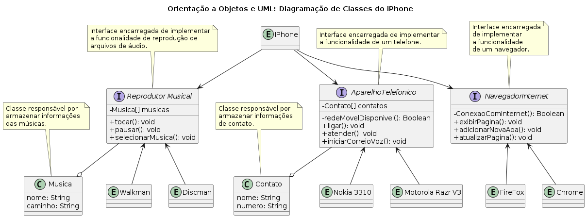

# Orientação a Objetos e UML: Diagramação de Classes do iPhone 

## Nome
Orientação a Objetos e UML: Diagramação de Classes do iPhone

## Descrição
Este projeto visa o desenvolvimento de uma implementação abrangente para abordar o desafio de modelagem de software, com o objetivo de representar as funcionalidades 
de um iPhone. Utilizando o uso dos princípios da programação orientada a objetos (POO) e aplicando as técnicas de modelagem UML, estabelecendo uma estrutura sólida 
e flexível que capacita um dispositivo iPhone a desempenhar três funções: Reprodutor Musical, Aparelho Telefônico e Navegador na Internet.

## Funcionalidades
Nesta seção, apresentamos uma explicação detalhada de cada classe representada no diagrama de classe do projeto. Cada classe desempenha um papel específico e contribui para a funcionalidade global do sistema.

### `iPhone`

A classe `iPhone` é a classe principal que representa o dispositivo como um todo. Ela implementa as interfaces `ReprodutorMusical`, `AparelhoTelefonico` e `NavegadorInternet`. Isso permite que o iPhone desempenhe os papéis de reprodutor musical, aparelho telefônico e navegador na Internet.

### `ReprodutorMusical`

A interface `ReprodutorMusical` define os métodos necessários para controlar a reprodução de música, como `tocar()`, `pausar()` e `selecionarMusica()`. As classes que implementam essa interface são capazes de reproduzir músicas.

### `AparelhoTelefonico`

A interface `AparelhoTelefonico` define os métodos para realizar chamadas telefônicas e enviar mensagens, incluindo `ligar()`, `atender()` e `iniciarCorreioVoz()`. As classes que implementam essa interface podem funcionar como dispositivos telefônicos.

### `NavegadorInternet`

A interface `NavegadorInternet` define métodos para a navegação na web, como `exibirPagina()`, `adicionarNovaAba()` e `atualizarPagina()`. As classes que implementam essa interface podem atuar como navegadores da Internet.

Cada classe ou interface desempenha um papel específico no sistema e contribui para a versatilidade do dispositivo iPhone, tornando-o capaz de realizar uma variedade de funções.

## Tecnologias
- Java v21

## Requisitos
- Necessário alguma IDE (IntelliJ, Visual Studio Code, Eclipse, etc);

## Inicialização
1 - Faça um clone do repositório através do git.

2 - Após realizar o procedimento acima, você pode abrir o README.md que está localizado na raiz do projeto (diretório principal) na IDE de sua preferência.

3 - Abaixo o diagrana de clases para melhor entendimento da funcionalidade:

   

## Colaboradores
Bruna Stefani Moreira Torres Francisco <a href="https://www.linkedin.com/in/bruna-moreira-torres-francisco/" target="_blank">LinkedIn</a>

## Status do Projeto
Concluído.
